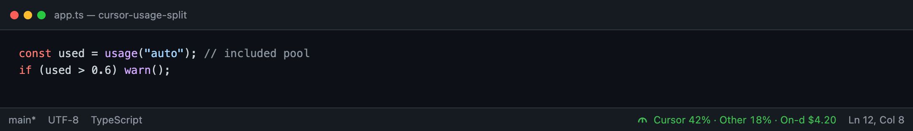
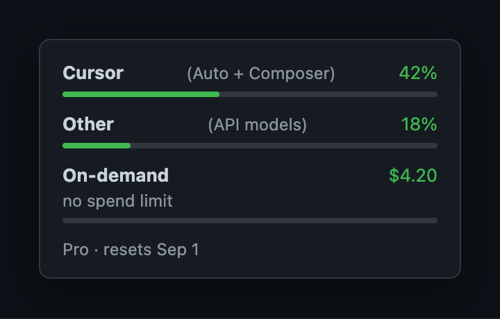
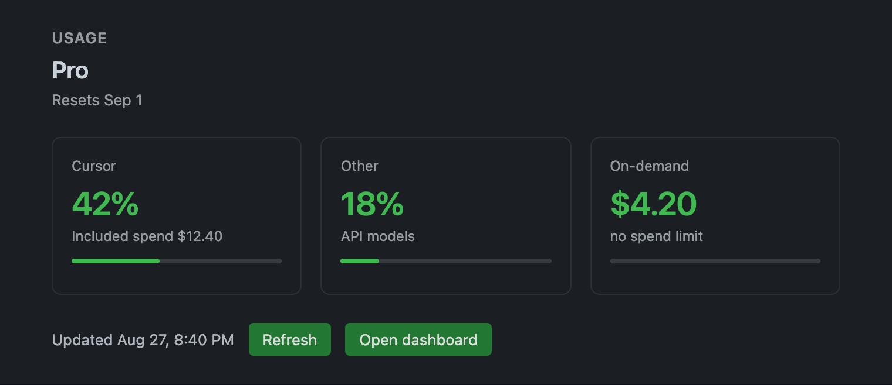

# Cursor Usage Split

Auto vs API usage, and on-demand spend, in the Cursor status bar. Color-coded. Zero config.

[](https://open-vsx.org/extension/rijojoy/cursor-usage-split)
[](https://open-vsx.org/extension/rijojoy/cursor-usage-split)



```
Cursor 42% · Other 18% · On-d $4.20
```

Green under 60%, yellow at 60%, red at 85% — worst of the three quotas. Polls every 10 seconds using the Cursor login already on disk. The only network calls go to `api2.cursor.sh`.

Unofficial. Not affiliated with Cursor. If they change that API, this breaks.

## Install

Cursor → Extensions → search **`rijojoy.cursor-usage-split`** (the full id finds it; a generic “cursor usage” search is crowded).

Or from a terminal:

```
cursor --install-extension rijojoy.cursor-usage-split
```

Open VSX: [rijojoy.cursor-usage-split](https://open-vsx.org/extension/rijojoy/cursor-usage-split)

## What you see

**Cursor** is Auto + Composer (included pool). **Other** is API models. **On-demand** is dollars in the bar; percent of cap only in the tooltip if a limit exists.

Hover the status item for the breakdown:



Click it (or **Cursor Usage Split: Open details**) for the panel:



## Commands

| Command | What it does |
|---|---|
| Cursor Usage Split: Refresh | Fetch usage now |
| Cursor Usage Split: Open details | Usage panel |
| Cursor Usage Split: Open dashboard | cursor.com/dashboard/usage |
| Cursor Usage Split: Diagnose auth | If the bar says Sign in / Auth |

## Settings

| Setting | Default | |
|---|---|---|
| `cursorUsageSplit.refreshIntervalMs` | `10000` | Minimum 10000 |
| `cursorUsageSplit.warningPercent` | `60` | Yellow at this % used |
| `cursorUsageSplit.criticalPercent` | `85` | Red at this % used |
| `cursorUsageSplit.showStatusBar` | `true` | Hide the item |

## How it works

Reads `cursorAuth/accessToken` from Cursor’s local `state.vscdb` (sql.js). Sends that Bearer token to Cursor’s dashboard API. Nothing is uploaded to a third-party server. No cookie paste.

## License

MIT.
